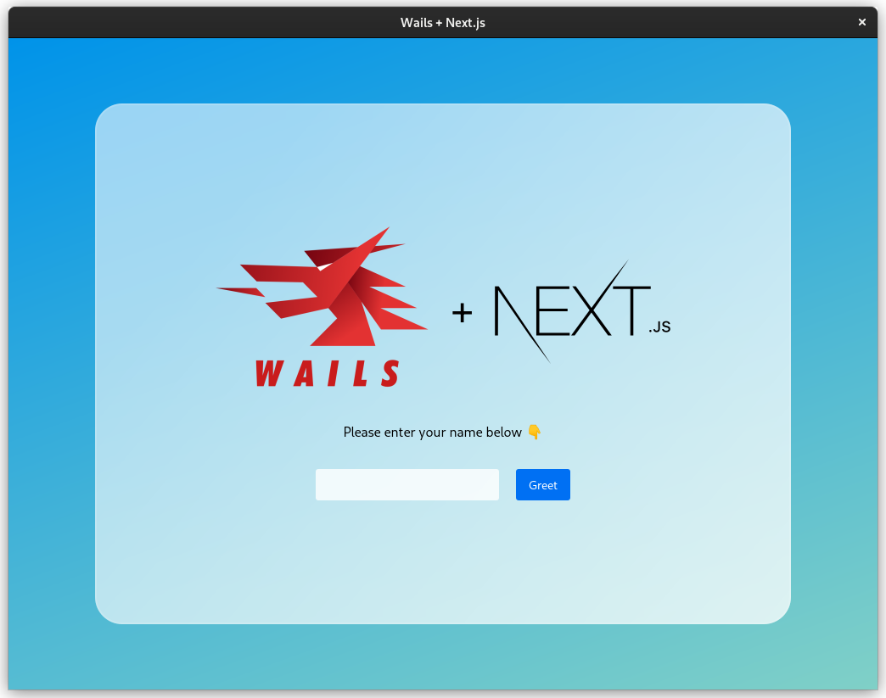

# Wails template Next.js


A [Wails](https://github.com/wailsapp/wails) template with [Next.js](https://github.com/vercel/next.js) and TypeScript.

You can develop applications using Next.js and then use Wails to package your application as a cross-platform program that is compatible with Linux, macOS and Windows. And you can easily call Go methods from JavaScript.

This project uses `next export` to export the Next.js application to static HTML, and then uses Wails to package the static files into a program, so some Next.js features are unsupported, see [https://nextjs.org/docs/advanced-features/static-html-export](https://nextjs.org/docs/advanced-features/static-html-export) for details.

# Screenshot



# Getting Started

## Prerequisites

- Go 1.17+
- Node JS
- NPM
- [Wails CLI](https://wails.io/docs/next/gettingstarted/installation/)

## New Project

You can create a new wails project using:

```bash
wails init -n "Your Project Name" -t https://github.com/LGiki/wails-template-nextjs
```

## Building

If you modified the Go code, you need to run `wails generate module` to generate the wailsjs modules first. Then using `wails build` to build your application.

You can run `wails build --help` or go to [https://wails.io/docs/next/reference/cli#build](https://wails.io/docs/next/reference/cli#build) to view all build flags.

## Live Development

To run in live development mode, run `wails dev` in the project directory.
